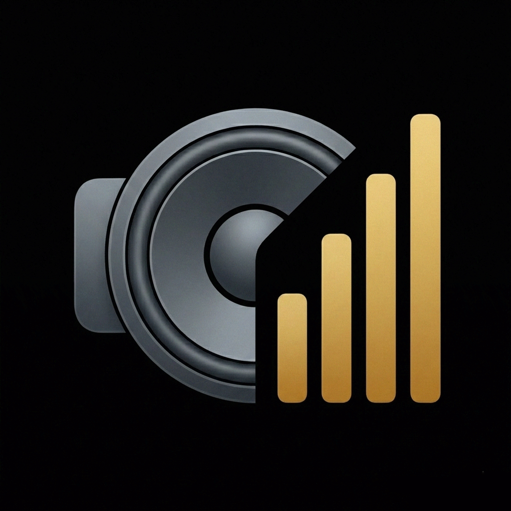
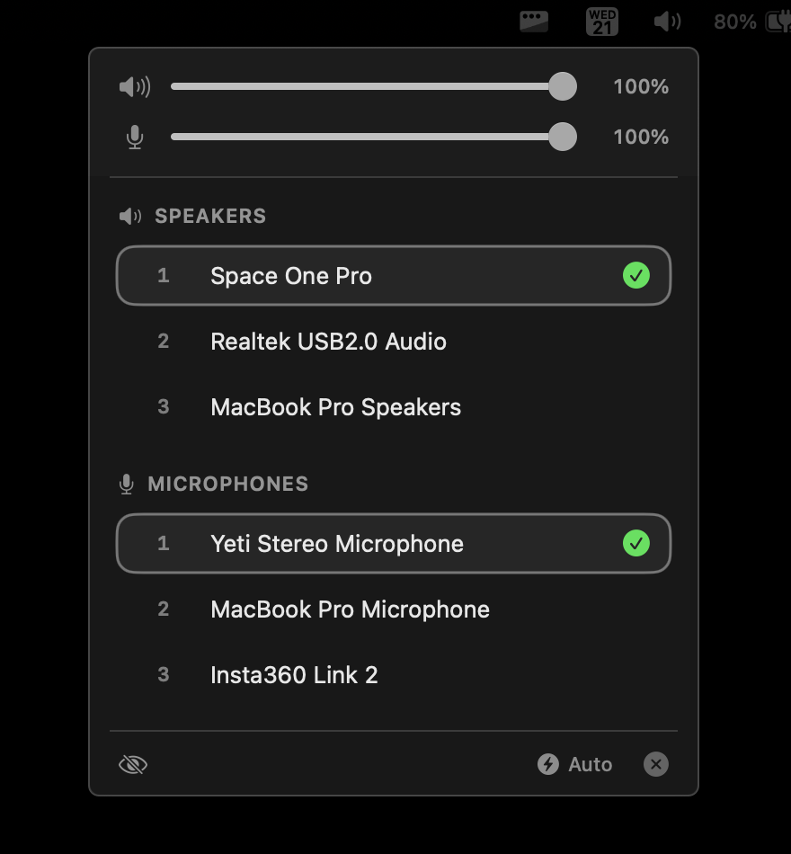

# audio-priority

<p align="center">
  
</p>

A native macOS menu bar app that automatically manages audio device priorities. Set your preferred order for speakers and microphones - the app automatically switches to the highest-priority connected device.

Website: https://badalotti.dev/audio-priority




## Features

- **Priority-based auto-switching**: Devices are ranked by priority. When a higher-priority device connects, it automatically becomes active.
- **Device memory**: Remembers your device priority order across reconnects.
- **Ignore devices**: Hide devices from the list.
- **Drag-to-reorder**: Reorder devices by dragging.
- **Speaker and mic volume**: Adjust both volumes with a slider or scroll wheel.
- **Graceful volume fallback**: Shows "-" when the system volume is unavailable.
- **Auto-switch toggle**: Enable or disable automatic device switching.
- **Menu bar integration**: Lightweight, always-available controls.

## Installation

### Requirements
- macOS 14.0 or later

### Homebrew (Cask)
```bash
brew install --cask mateusbadalotti/audio-priority/audio-priority
```

### Build from Source

1. Clone the repository:
   ```bash
   git clone https://github.com/mateusbadalotti/audio-priority.git && cd audio-priority
   ```

2. Build using the build script:
   ```bash
   ./build.sh
   ```

3. The app will be at `dist/AudioPriority.app`

Or open `audio-priority.xcodeproj` in Xcode and build with ⌘R.

### Download Release
Check the [Releases](https://github.com/mateusbadalotti/audio-priority/releases) page for pre-built binaries.

## Usage

### Managing Priorities

- **Click a device**: Select it as the active device (connected only)
- **Drag devices**: Reorder priority by dragging the handle

### Device Actions (right-click menu)

- **Ignore device**: Hide as speaker or microphone

### Auto-Switch

Use the **Auto** toggle in the footer to enable or disable automatic device switching.

## How It Works

1. **Device Discovery**: Uses CoreAudio to enumerate audio devices and listen for changes.
2. **Priority Storage**: Device priorities are stored in UserDefaults, keyed by device UID (stable across reconnects).
3. **Auto-Switching**: When devices connect/disconnect, the app automatically selects the highest-priority available device.

## Project Structure

```
audio-priority/
├── AudioPriorityApp.swift    # App entry, MenuBarExtra, AudioManager
├── Models/
│   └── AudioDevice.swift        # Device model
├── Services/
│   ├── AudioDeviceService.swift # CoreAudio wrapper
│   └── PriorityManager.swift    # Priority persistence
└── Views/
    ├── MenuBarView.swift        # Main popover UI
    └── DeviceListView.swift     # Device list and row components
```

## Contributing

Contributions are welcome! Please feel free to submit a Pull Request.

## License

MIT License - see [LICENSE](LICENSE) for details.

## Acknowledgments

Built with SwiftUI and CoreAudio for macOS.

Heavily inspired by https://github.com/tobi/AudioPriorityBar
