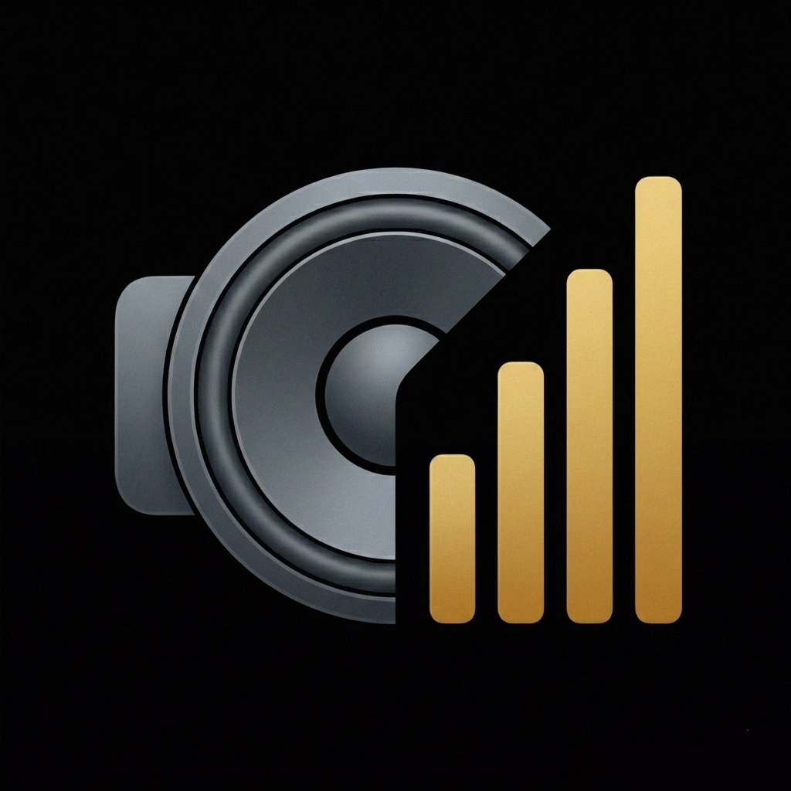

# audio-priority

<p align="center">
  
</p>

A native macOS menu bar app that manages audio device priorities. Set your preferred order for speakers and microphones, and the app switches to the highest-priority connected device.

Website: https://badalotti.dev/audio-priority


## Features

- **Priority-based auto-switching**: Devices are ranked by priority. When a higher-priority device connects, it automatically becomes active.
- **Device memory**: Remembers priority order, custom names, ignored devices, and volume locks across reconnects and app launches.
- **Ignore devices**: Hide devices from the list.
- **Custom device names**: Give any speaker or microphone an app-only name, then restore its original CoreAudio name at any time.
- **Drag-to-reorder**: Reorder devices by dragging.
- **Speaker and mic volume**: Adjust both volumes with a slider or scroll wheel.
- **Per-device volume locks**: Lock the active speaker or microphone at its current level. AudioPriority restores that level after external changes, device switches, reconnects, and app launches.
- **Graceful volume fallback**: Shows "-" when the system volume is unavailable.
- **Auto-switch toggle**: Enable or disable automatic device switching.
- **Menu bar integration**: Lightweight, always-available controls.

## Installation

### Requirements

- macOS 26.0 or later

### Homebrew cask

```bash
brew install --cask mateusbadalotti/tap/audio-priority
```

Update an existing installation with:

```bash
brew upgrade --cask audio-priority
```

### Build from source

1. Clone the repository:
   ```bash
   git clone https://github.com/mateusbadalotti/audio-priority.git && cd audio-priority
   ```

2. Build using the build script:
   ```bash
   ./build.sh
   ```

3. The app will be at `dist/AudioPriority.app`

Or open `audio-priority.xcodeproj` in Xcode and build with ⌘R.

### Download release

Check the [Releases](https://github.com/mateusbadalotti/audio-priority/releases) page for pre-built binaries.

## Usage

### Managing priorities

- **Click a device**: Select it as the active device (connected only)
- **Drag devices**: Reorder priority by dragging the handle

### Device actions (right-click menu)

- **Rename device**: Set a custom name used in the app
- **Restore original name**: Remove the custom name and show the name reported by CoreAudio
- **Ignore device**: Hide as speaker or microphone

Custom names only affect AudioPriority. They do not rename the device in macOS or other apps.

### Volume actions (right-click a slider)

- **Lock speaker volume**: Right-click the speaker slider to lock the active output device at its current level
- **Lock microphone volume**: Right-click the microphone slider to lock the active input device at its current level
- **Unlock volume**: Right-click the same slider and choose `Unlock speaker volume` or `Unlock microphone volume`

Locks belong to individual devices. While the current device is locked, its slider is disabled and a small lock badge appears on the volume icon.

### Auto-switch

Use the **Auto** toggle in the footer to enable or disable automatic device switching.

## How it works

1. **Device discovery**: CoreAudio provides the connected input and output devices and reports device or volume changes.
2. **Preference storage**: Priority order, ignored devices, custom names, and locked levels are stored in UserDefaults by stable device UID.
3. **Auto-switching**: When devices connect or disconnect, the app selects the highest-priority available device.
4. **Volume enforcement**: If the active device has a lock, the app restores its saved level whenever CoreAudio reports a volume change.

## Project structure

```
audio-priority/
├── AudioPriorityApp.swift    # App entry, MenuBarExtra, AudioManager
├── Models/
│   └── AudioDevice.swift          # Device model
├── Services/
│   ├── AudioDeviceService.swift   # CoreAudio device wrapper
│   └── PriorityManager.swift      # Priority persistence
└── Views/
    ├── MenuBarView.swift          # Main popover UI
    └── DeviceListView.swift       # Device list and row components
```

## Contributing

Contributions are welcome! Please feel free to submit a Pull Request.

## License

MIT License - see [LICENSE](LICENSE) for details.

## Acknowledgments

Built with SwiftUI and CoreAudio for macOS.

Heavily inspired by https://github.com/tobi/AudioPriorityBar
